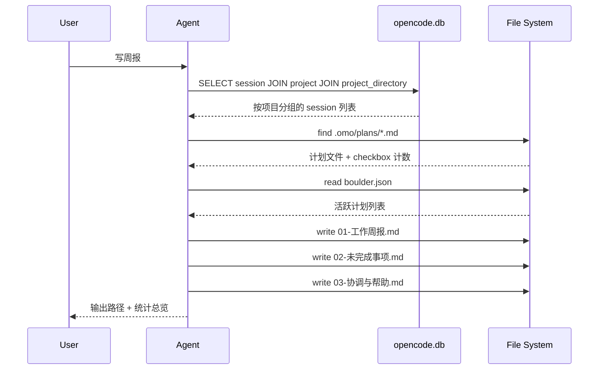

<p align="center">
  
</p>

<h1 align="center">weekly-report</h1>

<p align="center">
  <strong>OpenCode Skill — 自动生成结构化工作周报</strong>
</p>

<p align="center">
  <a href="https://github.com/ChrefTech/weekly-report/blob/main/LICENSE"></a>
  <a href="https://github.com/ChrefTech/weekly-report"></a>
  <a href="https://github.com/ChrefTech/weekly-report"></a>
  
</p>

---

## 功能

当你对 OpenCode 说「写周报」时，这个 skill 会：

- 从 OpenCode 的 **SQLite 数据库** 直接提取所有 session 记录（绕过内置 `session_list` 工具的项目路径限制）
- 扫描所有 `.omo/plans/` 下的计划文件，统计 checkbox 完成进度
- 读取 `boulder.json` 识别当前活跃计划
- 按**项目维度**汇总，生成三个结构化 markdown 文件

```
week-report/2026-06-08_2026-06-14/
├── 01-工作周报.md        ← 按项目汇总已完成工作 + 量化统计
├── 02-未完成事项.md       ← 所有开放计划进度 + 预计完成时间
└── 03-协调与帮助.md       ← 跨项目依赖、资源需求、优先级建议
```

## 为什么直接读数据库

内置的 `session_list` 工具默认只返回**当前工作目录**的 session。如果你在不同项目之间切换（例如 `~/Documents/geo`、`~/.ws/OMRobot`），它会漏掉其他项目的 session。

本 skill **直接 JOIN session + project + project_directory 三表查询**，确保覆盖所有项目。


## 安装

两种安装方式，选一种即可。

### 面向人类：复制 Prompt 安装

把下面这段话发给你的 OpenCode / Claude Code / Codex agent，它会自动完成安装：

> 请帮我安装 OpenCode skill `weekly-report`。仓库地址是 `https://github.com/ChrefTech/weekly-report`。下载 `SKILL.md` 到 `~/.agents/skills/weekly-report/SKILL.md`（Windows 用户放到 `%USERPROFILE%\.agents\skills\weekly-report\SKILL.md`）。如果目录不存在则创建。完成后验证文件可读，并确认 skill 已生效。

你的 agent 会：
1. 检测操作系统
2. 创建 `weekly-report` 目录
3. 下载 `SKILL.md`
4. 验证安装成功

### 面向 LLM Agent

如果你是 LLM agent 在执行安装，参考 [INSTALL.md](INSTALL.md)，里面有完整的 Linux / Windows PowerShell 安装步骤和依赖检查逻辑。

### 手动安装（终端）

```bash
# Linux / macOS
mkdir -p ~/.agents/skills/weekly-report
curl -fsSL https://raw.githubusercontent.com/ChrefTech/weekly-report/main/SKILL.md \
  -o ~/.agents/skills/weekly-report/SKILL.md

# Windows PowerShell
New-Item -ItemType Directory -Force -Path "$env:USERPROFILE\.agents\skills\weekly-report"
Invoke-WebRequest -Uri "https://raw.githubusercontent.com/ChrefTech/weekly-report/main/SKILL.md" \
  -OutFile "$env:USERPROFILE\.agents\skills\weekly-report\SKILL.md"
```

安装后重启 OpenCode 即可生效。

## 使用方式

直接对 OpenCode 说：

| 触发短语 | 效果 |
|---------|------|
| 「写周报」/「上周总结」 | 生成上周一至周日的报告 |
| 「本周工作汇报」 | 生成本周一至今天的报告 |
| 「weekly report」 | 同上（英文触发） |
| `/weekly-report` | 显式调用 skill |

输出默认保存到 `~/Documents/week-report/<日期范围>/`。

## 输出示例

### 01-工作周报.md

```markdown
## 一、Geo 内容平台
203 sessions / 17M tokens / $10.75 | 周三-周日

**已完成**
- 修复登录后返回登录页的循环跳转 bug
- 实现选题热度评分系统，接入真实百度指数数据
- 完成管理后台四大模块...
```

### 02-未完成事项.md

```markdown
| 事项 | 计划文件 | 进度 | 预计完成 | 说明 |
|------|---------|------|---------|------|
| ▶ AI Chat 页面 | ai-chat-generate.md | 19/103 | 6/21 | 当前活跃计划 |
| LangChain Agent | langchain-agent.md | 0/12 | 待定 | 尚未启动 |
```

### 03-协调与帮助.md

```markdown
## 跨项目依赖
| 依赖关系 | 阻塞方 | 被阻塞方 | 影响 |
|---------|--------|---------|------|
| 感知模型产出 | OMRobot (6/22) | piper_ros D435i 管线 | 85 项未启动 |
```

## 依赖

| 工具 | Linux | Windows |
|------|-------|---------|
| `sqlite3` | 预装 | `winget install SQLite.SQLite` |
| `python3` | 预装 | [python.org](https://python.org) |
| `rg` (ripgrep) | `apt install ripgrep` | `winget install BurntSushi.ripgrep.MSVC` |

如果 ripgrep 不可用，skill 会自动回退到 `grep` / `findstr`。

## 工作原理



## 项目结构

```
weekly-report/
├── .github/
│   └── logo.svg
├── SKILL.md          ← 核心 skill 定义
├── INSTALL.md        ← LLM Agent 安装指南
├── LICENSE           ← Apache 2.0
└── README.md         ← 本文件
```

## 贡献

欢迎提交 Issue 和 PR。如果你发现了新的 session 数据源、改进了查询效率，或者增加了新的报告维度，请贡献回来。

## 许可证

Apache 2.0 © 2026 [ChrefTech](https://github.com/ChrefTech)
